# Repurpose a Galaxy Tab 6 Keyboard with MicroPython

The Galaxy Tab 6 tablet can be used with a dedicated keyboard.
The keyboard connect the tablet through a Bluetooth connexion.
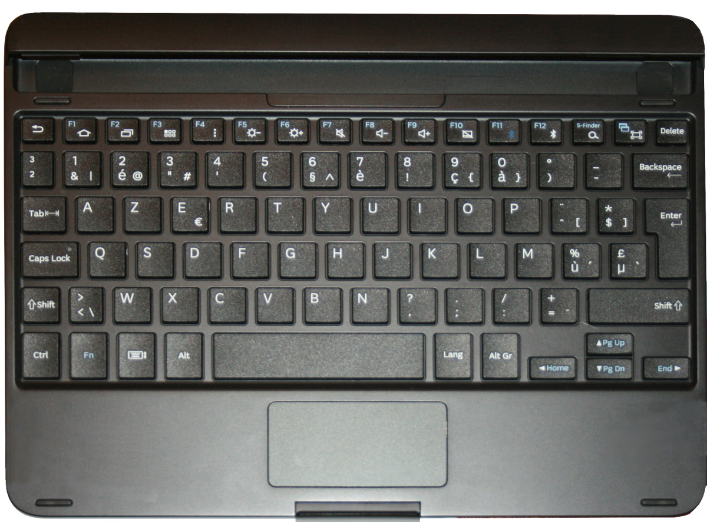
Galaxy Tab 6 from 2019 is now a deprecated hardware (2025, OS no more maintained).

__I wanted to repurpose the keyboard for some MicroPython projects__.
Unfortunately the bluetooth keyboard (bt 3.5) could not be paired with other devices. So I open the keyboard and tried to workaround the Bluetooth connectivity.

# The keyboard connector

Inside the keyboard we do find a small board, a lipo and a kind of "matrix" for coding the keyboard.
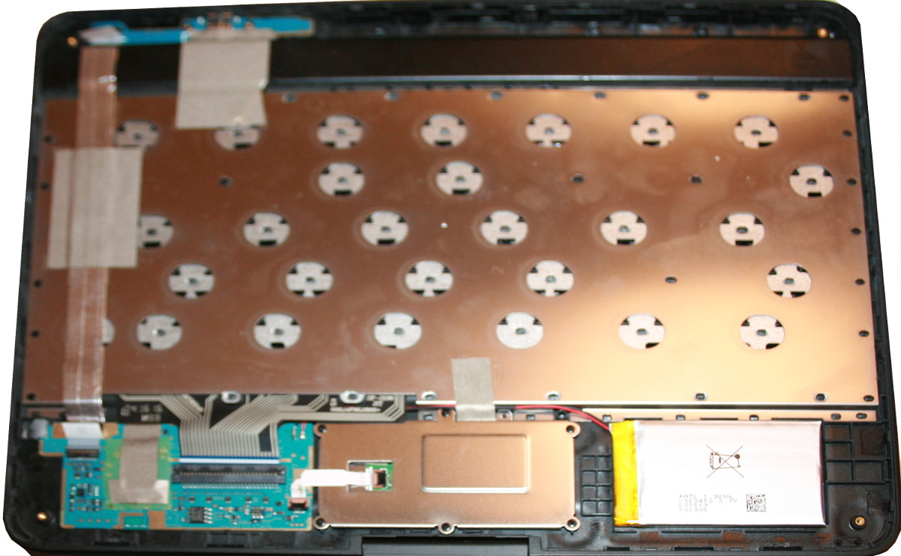

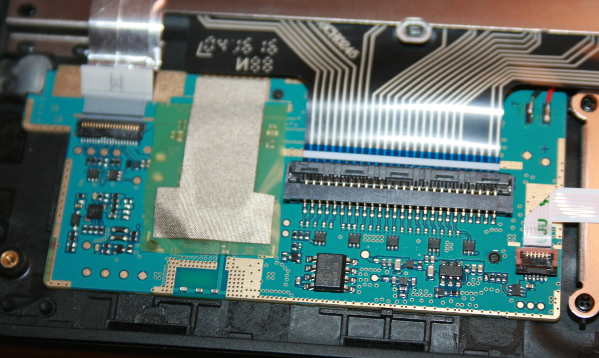

Usually a keypad are organized in column/row matrix making easy to detect which key is pressed. Just actives the column one by one and read the columns to detect which key is pressed. 
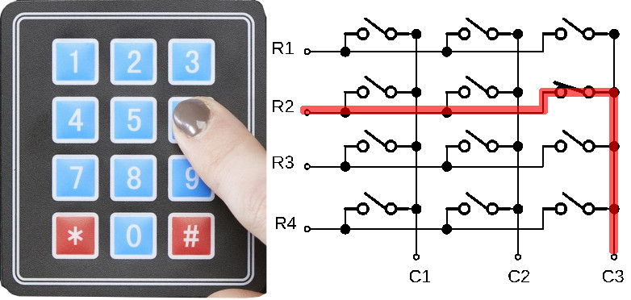

__Spoiler Alert__ : however, on the keyboard, some of the pins can act for both; the column and the row. It looks very strange but once understand, an appropriate read process can be applied.

Each keyboard lines is terminated by a 35 KΩ pull-down resistor except for line 1 to 5. So all lines & rows are tied to ground. Lines 1 to 5 
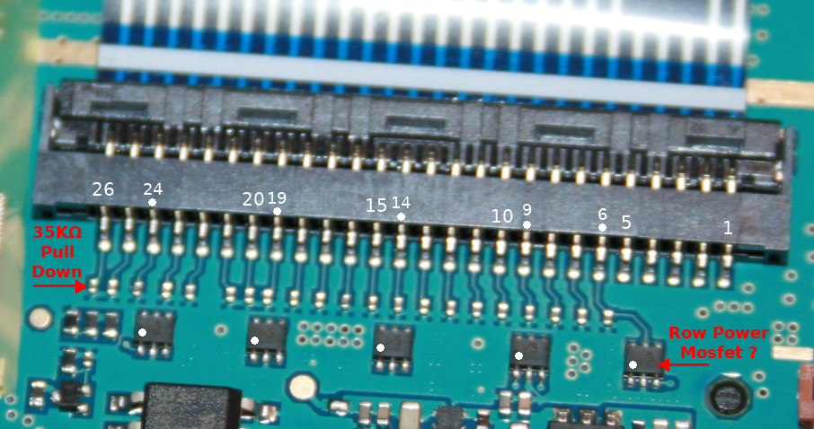
Some other lines (see the dots on the connector) are connected to an external chip labelled V5. 
Possibly a power line Mofset as this component is also used on a touchpad line. 

So I did expect that lines 6, 9,14,19,24 were row columns. The [tester1.py](examples/tester1.py) script demonstrated that I'm wrong. So I don't really know the behavior of such components and lines. 

# Hacking the keyboard matrix

By using 0.2mm varnished wire, it is possible to wire the connector outside of the keyboard. Using some hot-glue would be welcom to maintain the wires in place (and avoid them to break the solder joins).

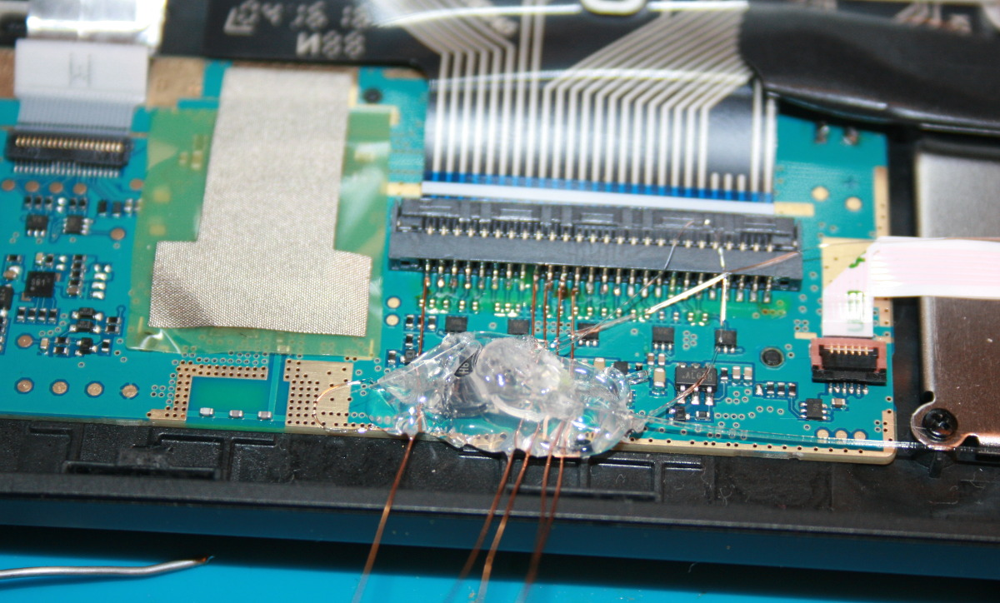

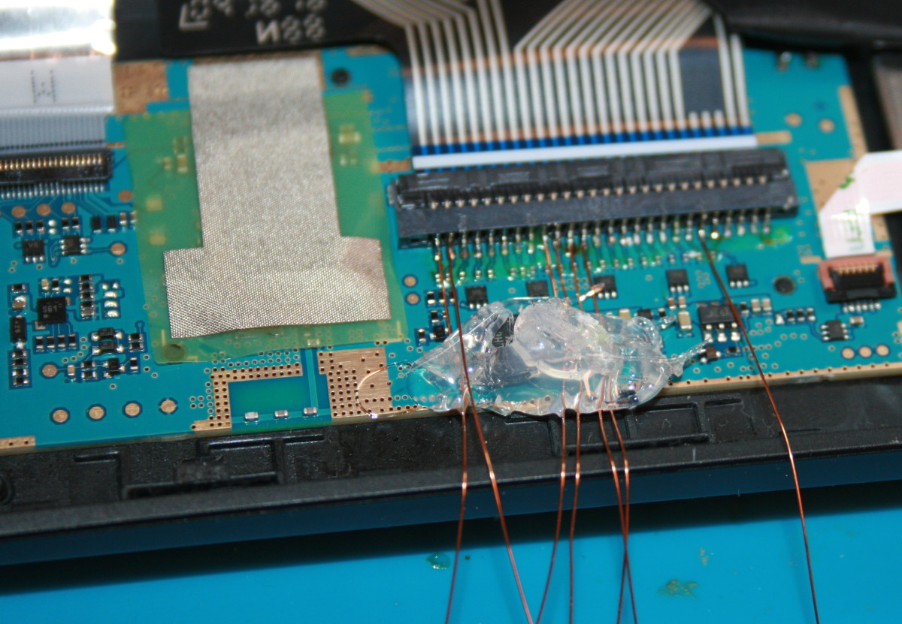

Using a [CMS Prototyping board](https://shop.mchobby.be/product.php?id_product=864) (Olimex), the wires were reported on a 2.54mm alike breakout.

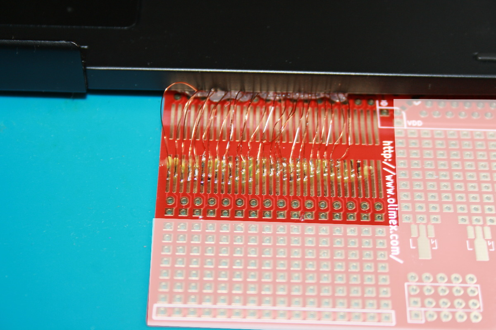

Then a Pico with 2x [MCP23017 GPIO expander](https://shop.mchobby.be/product.php?id_product=218) was connected to the keyboard breakout.

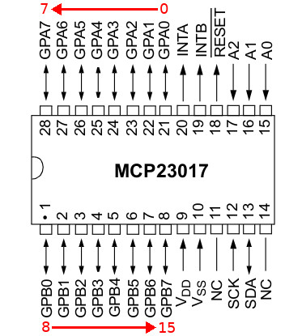

A particular attention was taken to connect the keyboard pins 1 to 26 in the same order than gpio expander. So, we have a direct mapping between the mcp23017 and the keyboard connector.


Despite many tests, it was difficult to get consistant results. Then I made the assumption that keyboard pin 1 to 5 didn't have pull-down because they are connected directly to the MCU (and MCU offering the pull-down service).

So I __added 22 KΩ pull-down on keyboard pin 1 to 5__ (MCP #0 GPIO 0 to 4) then everything went quite better!

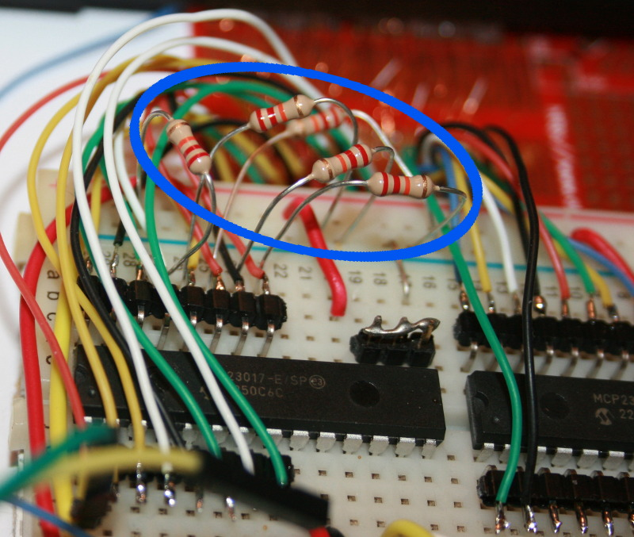

# Install the MCP2307 library for MicroPython

The test script and future library will requires the MCP23017 library. This can be installed on the micropython board with the following steps.


On a WiFi capable plateform:

```
>>> import mip
>>> mip.install("github:mchobby/esp8266-upy/mcp230xx")
```

Or via the mpremote utility :

```
mpremote mip install github:mchobby/esp8266-upy/mcp230xx
```
# Decipher the keyboard matrix

With the final setup we are now ready to run deeply in tests.

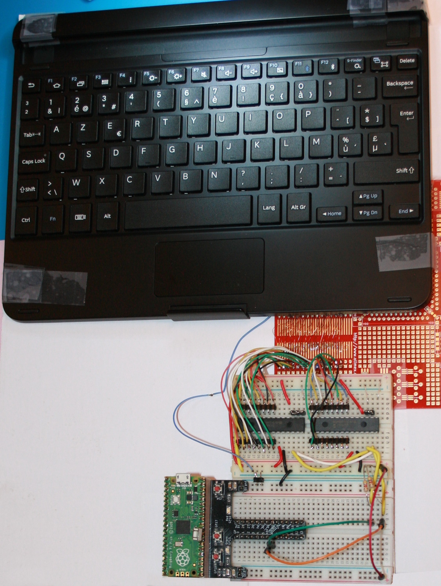

The [tester2.py](examples/tester2.py) was used to decipher the matrix. The script use the keyboard connector pin identification (so from 1 to 26).

Press a KEY on a keyboard then starts the script.

At startup, the script first turns all the MCP23017 GPIOs as input with activated pull-up.

Then the script select a pin, switch it as output and set it HIGH (this is the __driver pin__). The script will then scan the remaining 25 input pins to detect a HIGH level. 

If a HIGH level is detected then we identified the __read pin__ for the keyboard key. The script prints the __driver pin__, __read pin__ combination on the  output.

When the read pass is complete, the __driver pin__ is switch back to input mode with pull-up. The script then jump to the next __driver pin__ and repeat the read process.

The data is collected into the [scan-result.ods](docs/scan-result.ods) spreadsheet.

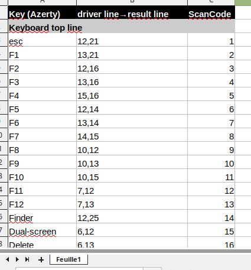

On the excerp here above, the F10 key is detected with the __driver pin__ 10 which activates the __read pin__ 15. 

The same __drive pin__ 10 is also used to detect the F9 key. This time, it will be on the __read pin__ 13.

Thanks to the [tester2-driver-pin-detect.py](examples/tester2-driver-pin-detect.py), all the drive pin and read pin have been identified.

* Driver pins : [6, 7, 8, 9, 10, 11, 12, 13, 14, 15, 16, 17, 18, 19, 20, 21]
* Read pins : [12, 13, 14, 15, 16, 17, 18, 19, 20, 21, 22, 23, 24, 25, 26]

## Quick read

The [tester3.py](examples/tester3.py) script is an optimized version of the former [tester2.py](examples/tester2.py). 

That version only activates the known driver pins then reads 16 GPIOs in one single operation (2 bytes transfer over the I2C bus).

## Possible optimisation

As each __driver pin__ controls a number of key it should be possible to activates several __driver pins__ without read conflict.

The [tester3-groups.py](examples/tester3-groups.py) script do check combination of __driver pins__. IF they is no overlap in the __read pins__ for two activated __driver pin__ THEN the two __driver pin__ can be actived together.

Here the result of the script:

```
Both 14 and 21 drive pins can be used at the same time
	 14 reads [15, 17, 18, 20, 19]
	 21 reads [22]
Both 6 and 17 drive pins can be used at the same time
	 6 reads [12, 13, 15, 20, 19, 18, 22]
	 17 reads [21, 26, 25]
Both 8 and 21 drive pins can be used at the same time
	 8 reads [13, 12, 17, 15, 19, 18, 20]
	 21 reads [22]
``` 

__Remark:__ the 21,22 is the W key, a rarely used key on an Azerty keyboard.

The drivers pin 6 & 17 also test the keys:

* Dual screen, Delete, ), ], Enter, µ, <
* 1, Caps Lock, Alt-Gr

# Making a PCB
Resulting from test, a PCB was designed with Kicad.

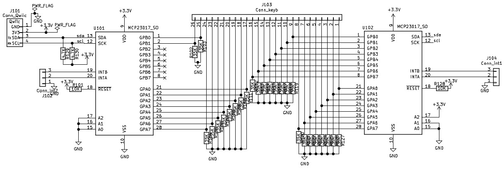

The 26 poles 1mm bottom contacts G-Switch connector is used to connect directly the flat ribbon. See [G-Switch GT-F1008SR20-26SMT01](https://www.lcsc.com/product-detail/C22387169.html) reference.

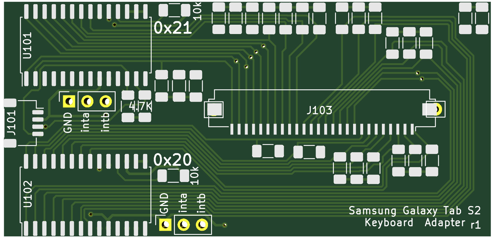

__VERY IMPORTANT NOTE:__

* Inspecting the schematic the U101 chip is set to __address 0x26__ (instead of 0x21)
* Compared to breadboard setup, the order of the both MCP have been inverted. So the __addresses sequence is 0x26, 0x20__ to access the keyboard pins in the right order!
* Testing the keyboard with the PCB revealed that connector __lines 9 and 10 have been inverted__ (see the [scan-result.ods](docs/scan-result.ods) )

Here a pictures of the assembled PCB and picture of the board put in place inside the keyboard.

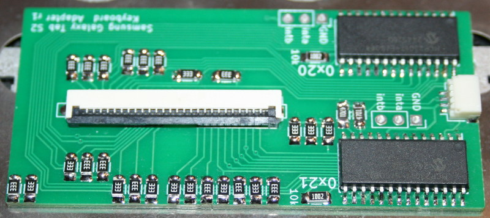

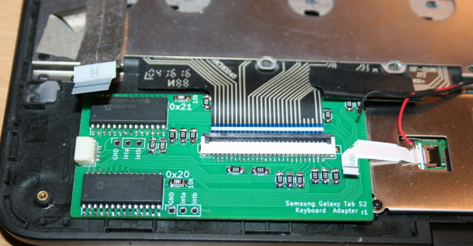

__GERBER FILES:__

The Gerber files are available in [kicad/sam-galaxy-mcp-board](kicad/sam-galaxy-mcp-board).

# Faster decoding
At this stage, we do know all possible driver pins and all possible reader pins. 

```
#   All driver pins : [6, 7, 8, 9, 10, 11, 12, 13, 14, 15, 16, 17, 18, 19, 20, 21]
#   All read   pins : [12, 13, 14, 15, 16, 17, 18, 19, 20, 21, 22, 23, 24, 25, 26]
```

The keyboard scan process works by activatiing each driver pin (on at the time) then check every reader pin for that driver pin.

However, this approach is very inefficient!

A better approach is to consider the keyboard connnector as a 32bits wide integer. Reading the keyboard matrix as an 32 bits integer results reduce the script complexity (from N+1 to N). 

The final solution consist in activating the driver pin (one at the time) then read the connector value. XORing the driver pin from the resulting integer then if the value is non zero we have a key pressed on the keyboard!
The algorithm return the value as read on the connector (so including the driver pin bit). This ensure a unique 32 bits value for the key.

__Unfortunately__ I have not been able to make this approach running properly.

# sgtkeyb - Samsung Galaxy Tab Keyboard Library
The [lib/sgtkeyb.py](lib/sgtkeyb.py) library implement reading methods for the MCP23017 based board.

The library expose the `SGTKeyb` class exposing various reading methods tested in the following examples.

The `SGTKeyb` class expose the following methods:

* __scan_matrix__ : low level method reading the matrix and returning a list of KeyID for the pressed keys.
* __scan_key__ : high level method returning the KeyID, its ASCII representation and a list of modifier key (Shift, Control, AltGr, ...).
* __read_key__ : high level function just returning the ASCII representation of the readed key.

Here below the following example and results for each of the keyboard reading methods.

## scan_matrix()
Use the `scan_matrix()` method which scans the matrix and return a list of key_id pressed by the user. This include key and modifier key. See the [scan-result.ods](docs/scan-result.ods) for list of key_id.

The [examples/lib-test/scan_matrix.py](examples/lib-test/scan_matrix.py) do `scan_matrix()` key to the keyboard then display it on the output.

See the result of the script here below.

```
[515]
[515]
[434]
[434]
[434]
[338]
[338]
[338]
[338]
[338, 515]
[338]
[338]
[338]
[338, 415]
[338, 415, 434]
[338, 415]
```

## scan_key()
Use the `scan_key()` method which scan the matrix and return a structure `(KeyID, ASCII, modifier_list)` .
Where:
* __KeyID__ : unique identifier ID of the key pressed (see the KEY_xxx constants in library). This will be reported for any key.
* __ASCII__ : ASCII character when it applies (otherwise None).
* __modifier_list__ : list of modifier keys applied with the returned key (KEY_SHIFTL, KEY_SHIFTR, KEY_CTRL, KEY_FN, KEY_ALT, KEY_ALTGR). See the [scan-result.ods](docs/scan-result.ods) for details.

The [examples/lib-test/scan_key.py](examples/lib-test/scan_key.py) do `scan_key()` call to the keyboard then display it on the output.

```
515, 'a', [])
(434, 'z', [])
(382, 'e', [])
(338, None, [338])
(382, 'E', [338])
(338, None, [338])
(338, None, [338])
(338, None, [338])
(338, None, [338])
(338, None, [338])
(338, None, [338])
(338, None, [338])
(338, None, [338])
(338, None, [338])
(384, 'D', [338])
(338, None, [338])
(228, ':', [])
(384, 'd', [])
(382, 'e', [])
(435, 's', [])
(301, 't', [])
(252, 'i', [])
(280, 'n', [])
(515, 'a', [])
(515, 'a', [])
(301, 't', [])
(252, 'i', [])
(225, 'o', [])
(280, 'n', [])
(204, ' ', [])
(305, 'f', [])
(252, 'i', [])
(280, 'n', [])
(515, 'a', [])
(227, 'l', [])
(382, 'e', [])
(492, None, [492])
```

Notes:

* some keys have no textual representation and are not modifier key (EG: ESC, Del, BackSpace, Arrow Key, etc).
* When the only the pressed is a modifier key, then it is reported as key_id (and inside the modifier list).

## read_key()
Use the `read_key(timeout=None)` method which scan the matrix and returns the the ASCII char corresponding (Uppercase, LowerCase, altgr) as long as it can be reproduced by MicroPython. 

If nothing readable (or timeout), the function returns None.

Some special characters like ENTER, ESC, TAB, BACKSPACE, ... are also returned by the `read_key()` method.

__Remarks:__ 

* Maintaining the KeyDown will start repeating it. 
* The class expose the `SGTKeyb.repeat_start` property (default 1000 ms) indicating the minimum keypress time to start repeating the key.

The [read_key.py example](examples/lib-test/read_key.py) is quite simple and outputs the captured chars onto the REPL output.

``` python
from machine import Pin, I2C
from mcp230xx import MCP23017
import time, sys
from sgtkeyb import *

# Raspberry-Pi Pico
i2c = I2C(1,  sda=Pin(6), scl=Pin(7), freq=400_000 )

kb = SGTKeyb(i2c, 0x24, 0x20)
while True:
  _c = kb.read_key() # read a char or None
  if _c != None:
      sys.stdout.write( _c )
```

Which can produce the following result on the REPL output.

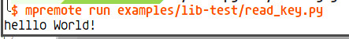

